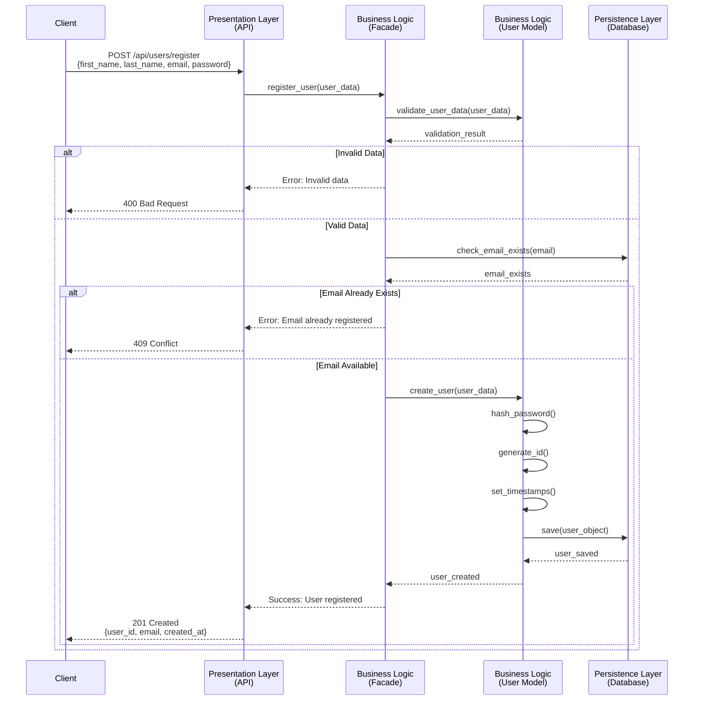
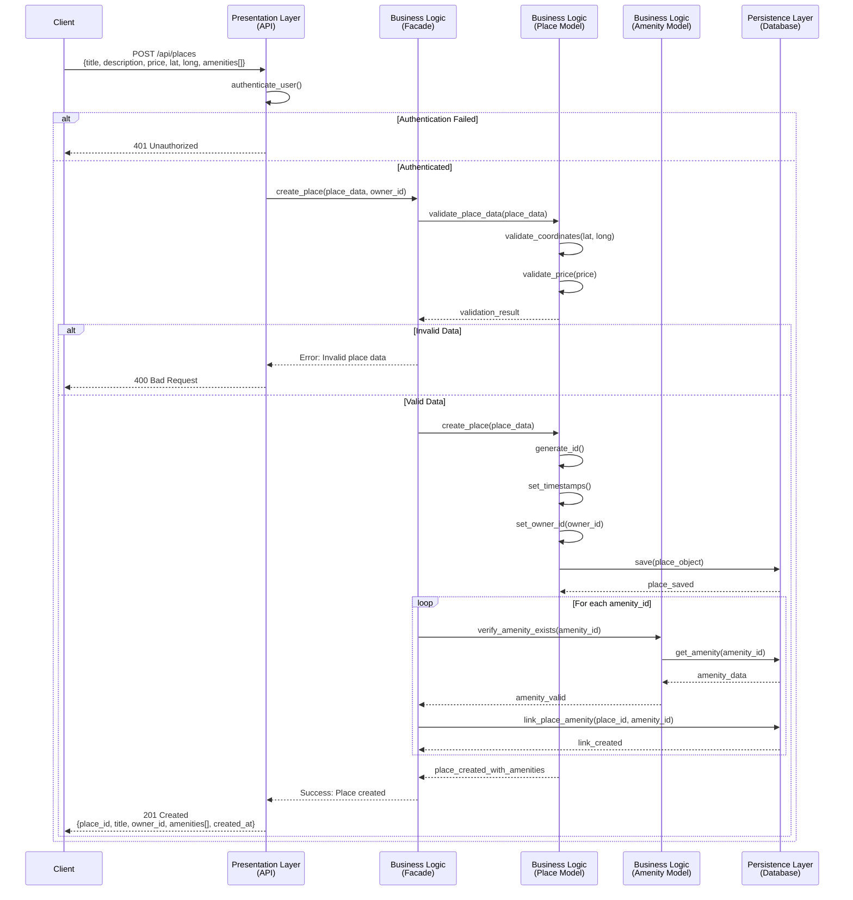
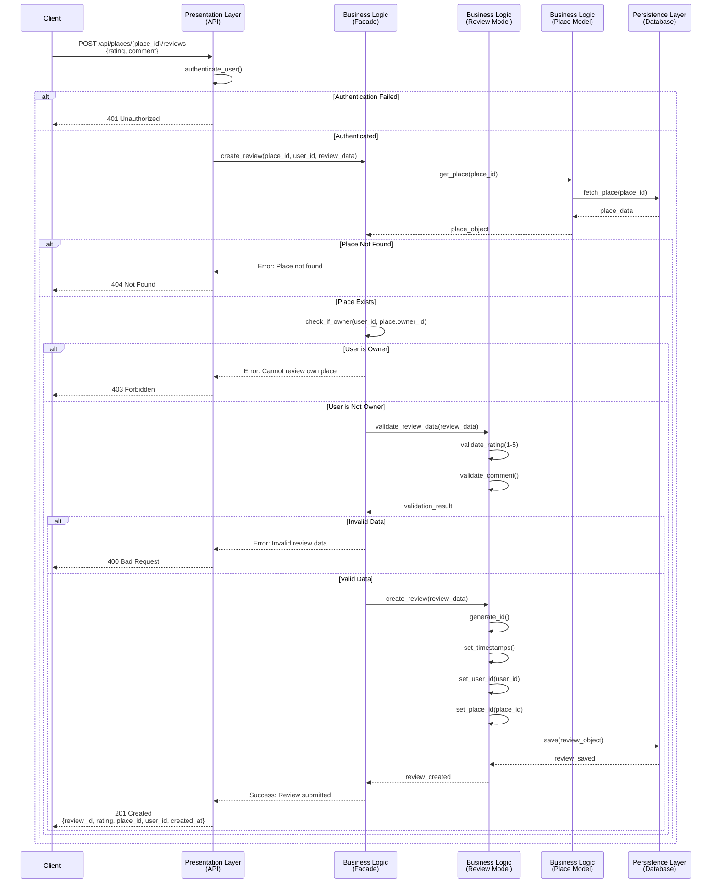
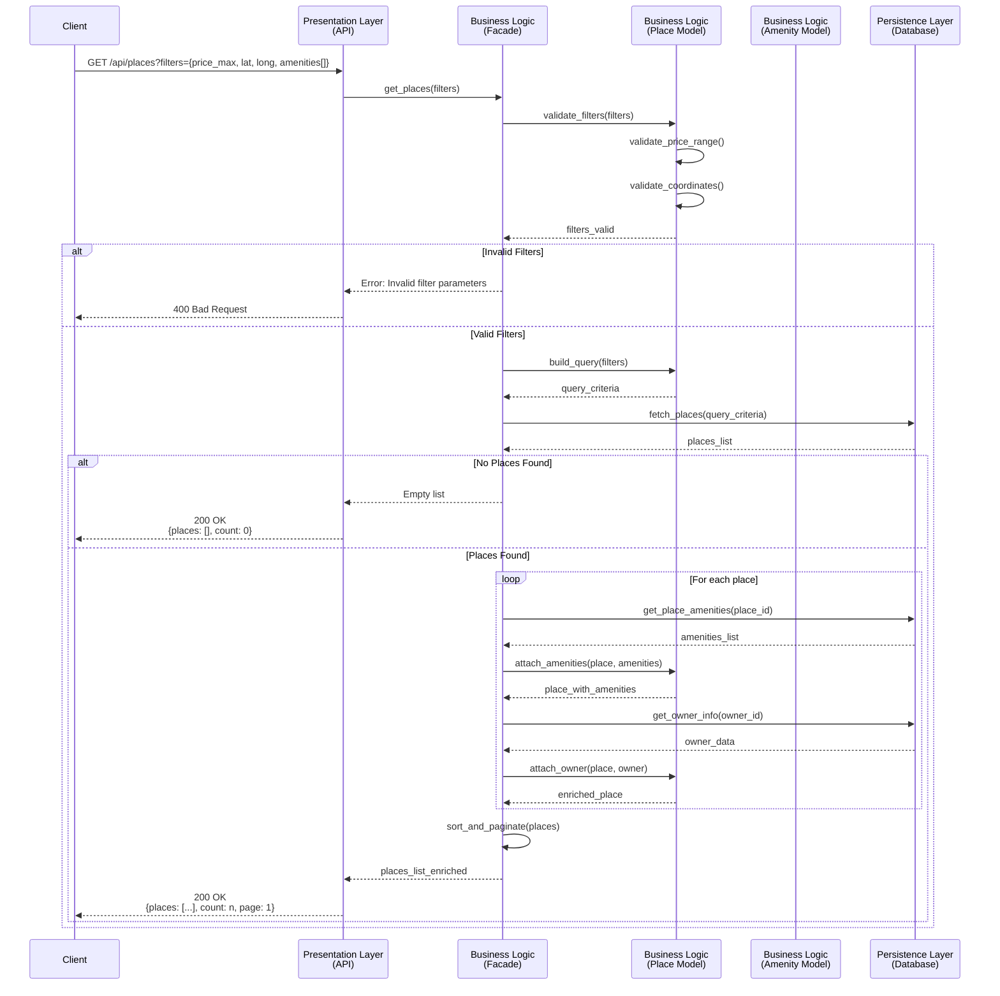

# 2. Sequence Diagrams for API Calls

This document presents detailed sequence diagrams for four critical API operations in the HBnB Evolution application. Each diagram illustrates the complete flow of interactions between the Presentation Layer, Business Logic Layer, and Persistence Layer.

---

## Overview

The sequence diagrams demonstrate how the system handles requests through the three-layer architecture using the Facade Pattern. Each diagram shows:
- Request initiation from the client
- Validation and processing in the Business Logic
- Data persistence operations
- Response flow back to the client

---

## 1. User Registration

**Use Case**: A new user signs up for an account in the HBnB application.

**Flow Description**:
1. User submits registration data (first_name, last_name, email, password)
2. API receives the request and forwards it to the Facade
3. Business Logic validates the data and checks for duplicate emails
4. If valid, user data is hashed (password) and saved to the database
5. Success response is returned with the new user's information

**Key Points**:
- Email uniqueness is validated before creating the user
- Password is hashed for security before storage
- UUID is automatically generated for the user
- Timestamps (created_at, updated_at) are set automatically

---

## 2. Place Creation

**Use Case**: A registered user creates a new place listing.

**Flow Description**:
1. User submits place details (title, description, price, location, amenities)
2. API authenticates the user and validates ownership rights
3. Business Logic validates place data and coordinates
4. Place is created and associated with the owner
5. Selected amenities are linked to the place

**Key Points**:
- User authentication is required before place creation
- Coordinates (latitude, longitude) are validated for proper ranges
- Price must be a positive value
- Amenities are verified to exist before linking
- Many-to-many relationship between Place and Amenity is established

---

## 3. Review Submission

**Use Case**: A user submits a review for a place they visited.

**Flow Description**:
1. User submits review data (rating, comment) for a specific place
2. API authenticates the user
3. Business Logic validates the review and checks if place exists
4. System prevents owner from reviewing their own place
5. Review is saved and linked to both user and place

**Key Points**:
- User must be authenticated to submit a review
- Place existence is verified before creating review
- Business rule: Users cannot review their own places
- Rating must be between 1 and 5
- Each review is linked to both a user and a place

---

## 4. Fetching a List of Places

**Use Case**: A user requests a list of available places, optionally filtered by criteria.

**Flow Description**:
1. User requests places list with optional filters (location, price range, amenities)
2. API receives request with query parameters
3. Business Logic processes filters and builds query criteria
4. Database retrieves matching places with their associated amenities
5. Results are formatted and returned to the client

**Key Points**:
- No authentication required for browsing places (public endpoint)
- Filters are validated before querying database
- Each place includes its associated amenities
- Owner information is included for each place
- Results can be sorted and paginated
- Empty results return successfully with count of 0

---

## Summary

These sequence diagrams demonstrate the complete flow of four critical operations in the HBnB Evolution application:

1. **User Registration**: Shows validation, email uniqueness check, and secure password handling
2. **Place Creation**: Demonstrates authentication, data validation, and amenity linking
3. **Review Submission**: Illustrates business rules enforcement (no self-reviews) and relationship management
4. **Fetching Places**: Shows query building, filtering, and data enrichment with related entities

Each diagram follows the three-layer architecture pattern with clear separation of concerns:
- **Presentation Layer**: Handles HTTP requests/responses and authentication
- **Business Logic Layer**: Validates data, enforces business rules, and orchestrates operations
- **Persistence Layer**: Manages data storage and retrieval

The Facade Pattern is consistently used to provide a clean interface between layers, ensuring maintainability and scalability of the application.

---

## Design Decisions

1. **Authentication Flow**: Placed at the API layer to catch unauthorized requests early
2. **Validation Strategy**: Two-level validation (format validation in Business Logic, existence checks in Persistence)
3. **Error Handling**: Clear error responses with appropriate HTTP status codes
4. **Data Enrichment**: Related data (amenities, owner info) is fetched and attached in the Business Logic layer
5. **Timestamps**: Automatically managed by the model layer for audit purposes

These diagrams serve as a blueprint for implementing the API endpoints and ensure consistent behavior across the application.
