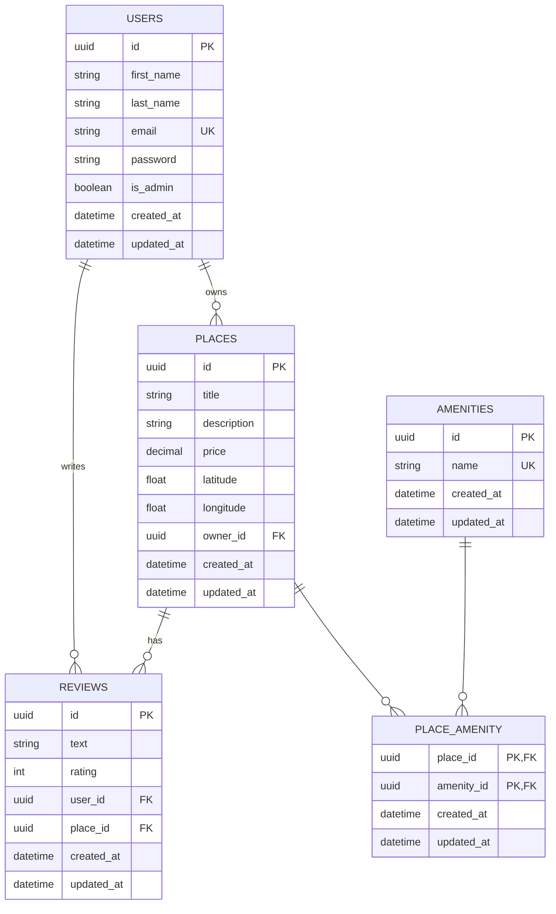

```mermaid

erDiagram
    USERS {
        uuid id PK
        string first_name
        string last_name
        string email UK
        string password
        boolean is_admin
        datetime created_at
        datetime updated_at
    }

    PLACES {
        uuid id PK
        string title
        string description
        decimal price
        float latitude
        float longitude
        uuid owner_id FK
        datetime created_at
        datetime updated_at
    }

    REVIEWS {
        uuid id PK
        string text
        int rating
        uuid user_id FK
        uuid place_id FK
        datetime created_at
        datetime updated_at
    }

    AMENITIES {
        uuid id PK
        string name UK
        datetime created_at
        datetime updated_at
    }

    PLACE_AMENITY {
        uuid place_id PK,FK
        uuid amenity_id PK,FK
        datetime created_at
        datetime updated_at
    }

    USERS ||--o{ PLACES : "owns"
    USERS ||--o{ REVIEWS : "writes"
    PLACES ||--o{ REVIEWS : "has"
    PLACES ||--o{ PLACE_AMENITY : ""
    AMENITIES ||--o{ PLACE_AMENITY : ""

```
