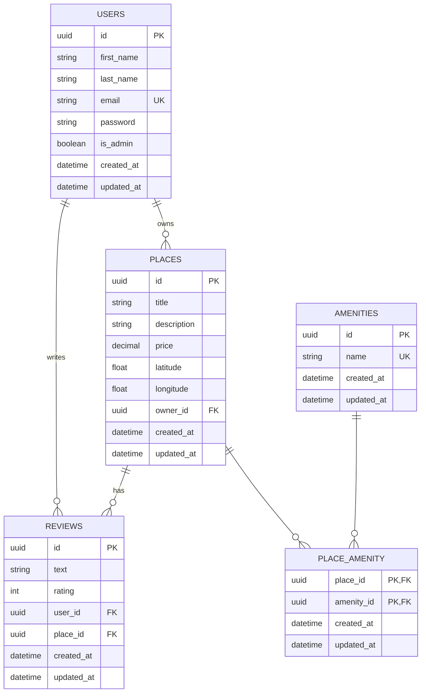

# 🏠 HBnB – Part 2: Business Logic & API

## 📆 Project Structure

This project follows a modular structure to ensure maintainability and scalability. The current setup implements the foundation for the Business Logic Layer (BLL), the API, and the in-memory persistence layer.

```
root@ip-10-42-229-106:~/holbertonschool-hbnb/part3# tree
.
|-- API_TESTING.md
|-- DATABASE_DIAGRAM.md
|-- README.md
|-- app
|   |-- __init__.py
|   |-- api
|   |   |-- __init__.py
|   |   `-- v1
|   |       |-- __init__.py
|   |       |-- amenities.py
|   |       |-- auth.py
|   |       |-- places.py
|   |       |-- protected.py
|   |       |-- reviews.py
|   |       `-- users.py
|   |-- extensions.py
|   |-- models
|   |   |-- __init__.py
|   |   |-- amenity.py
|   |   |-- base_model.py
|   |   |-- place.py
|   |   |-- review.py
|   |   `-- user.py
|   |-- persistence
|   |   |-- __init__.py
|   |   `-- repository.py
|   `-- services
|       |-- __init__.py
|       |-- facade.py
|       `-- repositories
|           |-- __init__.py
|           `-- user_repository.py
|-- config.py
|-- crud_tests.sql
|-- development.db
|-- initial_data.sql
|-- requirements.txt
|-- run.py
|-- tables.sql
`-- test
    |-- test_amenities.py
    |-- test_auth.py
    |-- test_places.py
    `-- test_reviews.py
```

## 🧠 Key Concepts Implemented

* ✅ Modular application structure
* ✅ Flask app factory pattern (`create_app`)
* ✅ flask-restx setup with Swagger UI (`/api/v1/`)
* ✅ In-memory repository following the Repository Pattern
* ✅ Facade layer to decouple API and logic
* ✅ Project ready for future integration with SQLAlchemy

### 📦 Entities and Responsibilities

Below is the ER diagram representing the core entities and their relationships in the HBnB system, created using Mermaid.js:



## ⚙️ Getting Started

### 🔹 Install dependencies

We recommend using a virtual environment:

```bash
python3 -m venv venv
source venv/bin/activate
pip install -r requirements.txt
```

### 🔹 Run the application

```bash
python run.py
```

Access the Swagger UI at:
[http://localhost:5000/api/v1/](http://localhost:5000/api/v1/)

## 🔧 Technologies Used

* Python 3.x
* Flask
* Flask-RESTx
* Repository Pattern
* Facade Pattern

## 🧑‍💻 Authors

* Ali Abdullah Summan
* Ali Hassan Almaghrabi
* Omar Hail Alanzi

## 📚 References

* [Flask Documentation](https://flask.palletsprojects.com/)
* [Flask-RESTx Docs](https://flask-restx.readthedocs.io/)
* [Python Project Structure Best Practices](https://docs.python-guide.org/writing/structure/)
* [Facade Design Pattern](https://refactoring.guru/design-patterns/facade/python/example)
